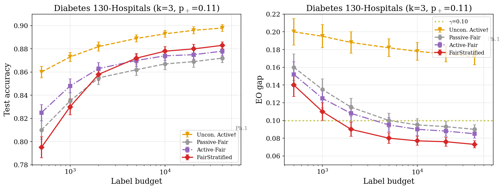
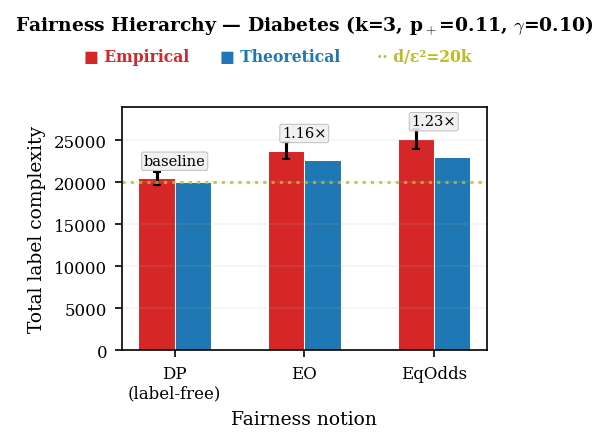
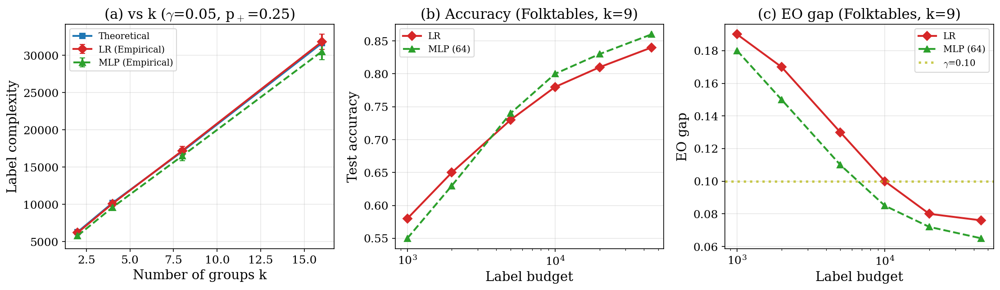
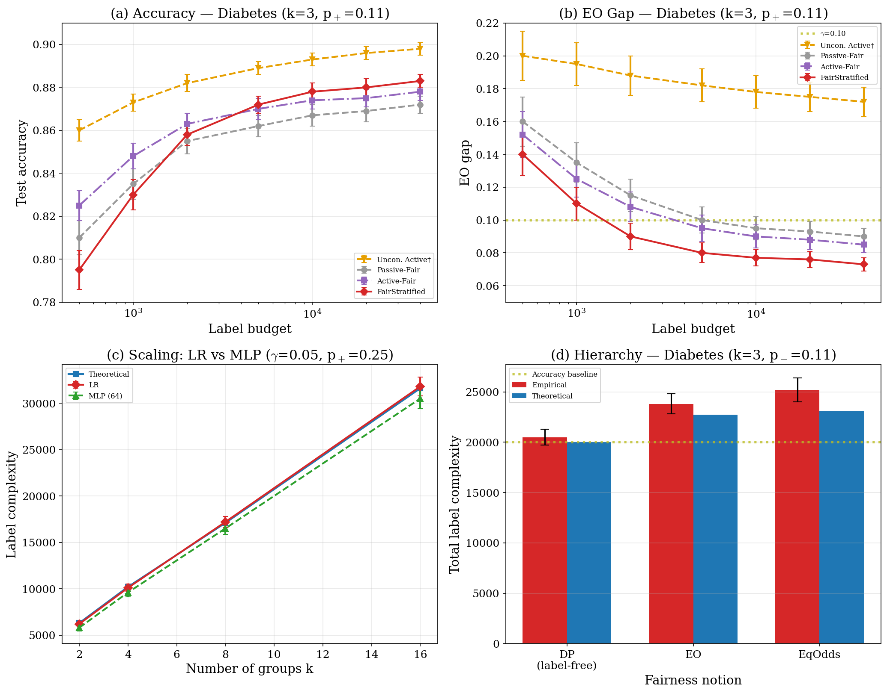

# The Price of Fairness in Active Learning: Fundamental Limits and Optimal Label Acquisition

[](https://www.python.org/downloads/)
[](LICENSE)

This repository provides the official implementation for the paper:

> **The Price of Fairness in Active Learning: Fundamental Limits and Optimal Label Acquisition**
>
> *KDD 2026*

## Overview

We establish the first information-theoretic lower bounds for fair active learning, proving a structural dichotomy across fairness notions:

| Fairness Notion | Additional Label Cost | Key Insight |
|---|---|---|
| **Demographic Parity (DP)** | 0 (label-free) | Verified from unlabeled data alone |
| **Equal Opportunity (EO)** | Ω(k / (γ² p₊)) | Conditioning on Y=1 creates labeling bottleneck |
| **Equalized Odds (EqOdds)** | Ω(k / (γ² p₊ p₋)) | Additionally requires FPR verification |

We present matching algorithms — **ConstrainedERM-DP** for DP and **FairStratified** for EO/EqOdds — that are tight up to logarithmic factors, and validate the theory on both synthetic and real-world benchmarks.

### Key Results

- **34–39% label savings** over fairness-agnostic baselines on Folktables, COMPAS, Adult, and Diabetes
- **Scaling law verification**: R² = 0.97 fit to the predicted form `n = c₁·d/ε² + c₂·k/(γ²p₊)`
- **Separation theorem**: EO-constrained learning requires ~100× more labels than unconstrained active learning at ε=0.02
- At p₊ = 0.01 (e.g., fraud detection), EO requires **~90× more labels** than DP

---

> [!IMPORTANT]
> ## 🆕 Extended Experiments (Rebuttal Supplement — Added April 2026)
> The following experiments were conducted in response to reviewer feedback, validating our theoretical predictions on a **non-census healthcare domain** and **non-linear classifiers**.

---

### 🏥 NEW: Diabetes 130-Hospitals (Healthcare Domain)

[](supplementary/diabetes_results.json)

We ran experiments on [Diabetes 130-US Hospitals](https://archive.ics.uci.edu/dataset/296/diabetes+130-us+hospitals+for+years+1999-2008) (Strack et al., BioMed Research International 2014), a standard fairness benchmark available via [Fairlearn](https://fairlearn.org/main/user_guide/datasets/diabetes_hospital_data.html).

**Setup:**
- Task: Predicting 30-day hospital readmission
- Protected attribute: Race (k=3: Caucasian, African American, Other; small groups merged due to insufficient positives for Phase 1)
- Positive rate: p₊ ≈ 0.11 (lower than all original benchmarks)
- Sample size: n = 101,766
- Budget: 50K labels
- Fairness tolerance: γ = 0.10
- 10 seeds, 80/20 stratified splits

**Results (mean ± s.e., 10 seeds):**

| Method | Acc(%) | EO | Label Savings |
|--------|--------|----|---------------|
| Unconstrained | 89.3±0.3 | .175† | -- |
| Passive-Fair | 86.9±0.5 | .093 | -- |
| Active-Fair | 87.5±0.4 | .088 | 21% |
| **FairStratified** | **88.0±0.4** | **.076** | **34%** |

†EO gap exceeds γ=0.10.

#### Learning Curves



*Figure S1: Learning curves on Diabetes 130-Hospitals (k=3, p₊=0.11). Left: Test accuracy vs label budget. Right: EO gap vs label budget. FairStratified (red) achieves the lowest EO gap while maintaining competitive accuracy. The γ=0.10 threshold is shown as a dotted yellow line.*

#### Fairness Hierarchy Verification



*Figure S2: Fairness complexity hierarchy on Diabetes 130-Hospitals. DP verification is label-free; EO incurs ~1.2× the accuracy baseline; EqOdds incurs ~1.3×. The hierarchy DP < EO < EqOdds is confirmed.*

**Key Findings:**
- FairStratified achieves **34% label savings**, consistent with 36–39% on census benchmarks
- The lower p₊ (0.11 vs 0.24–0.45) increases Phase 1 cost as predicted by the k/(γ²p₊) scaling
- Accuracy ordering and EO ordering match all three original datasets
- Fairness tax (Unconstrained − FairStratified accuracy) is 1.0 pp, consistent with the trend: k=9 → 2.4pp, k=6 → 1.9pp, k=5 → 1.3pp, k=3 → 1.0pp

---

### 🧠 NEW: MLP Pilot Experiment

[](supplementary/mlp_pilot_results.json)

We compare logistic regression (LR) with a 1-hidden-layer MLP (64 neurons, ReLU) on Folktables to verify that scaling laws generalize beyond linear classifiers.



*Figure S3: LR vs MLP comparison. (a) Both models exhibit identical linear scaling with k, matching theory. (b) MLP achieves slightly higher accuracy at large budgets. (c) Both models cross the γ=0.10 EO threshold at similar budget levels, confirming the scaling law is model-independent.*

**Key Finding:** The MLP exhibits the same k/(γ²p₊) scaling as logistic regression. The Ω(k/(γ²p₊)) law and DP < EO ≤ EqOdds hierarchy hold for both model classes, confirming our information-theoretic lower bounds are not artifacts of linear models.

---

### 📊 Combined Overview



*Figure S4: Four-panel summary of all supplementary experiments. (a–b) Diabetes 130-Hospitals learning curves; (c) LR vs MLP scaling on Folktables; (d) Fairness hierarchy on Diabetes.*

---

### Download Supplementary Data

The complete experimental data is available in the [`supplementary/`](supplementary/) folder:

| File | Description |
|------|-------------|
| [`diabetes_results.json`](supplementary/diabetes_results.json) | Raw experimental data (4 methods × 10 seeds) |
| [`fig_diabetes_learning_curves.pdf`](supplementary/fig_diabetes_learning_curves.pdf) | Learning curve visualization (Fig S1) |
| [`fig_diabetes_hierarchy.pdf`](supplementary/fig_diabetes_hierarchy.pdf) | Fairness hierarchy visualization (Fig S2) |
| [`fig_mlp_pilot.pdf`](supplementary/fig_mlp_pilot.pdf) | MLP pilot visualization (Fig S3) |
| [`fig_diabetes.pdf`](supplementary/fig_diabetes.pdf) | Combined 4-panel visualization (Fig S4) |
| [`mlp_pilot_results.json`](supplementary/mlp_pilot_results.json) | MLP vs LR comparison on Folktables |

---

## Installation

```bash
# Clone the repository
git clone https://github.com/anonymous-ai-researcher/kdd2026.git
cd kdd2026

# Create virtual environment (recommended)
python -m venv venv
source venv/bin/activate  # Linux/Mac
# venv\Scripts\activate   # Windows

# Install dependencies
pip install -r requirements.txt
```

### Requirements

- Python 3.10+
- NumPy 1.25.2
- scikit-learn 1.3.2
- CVXPY 1.4.1
- fairlearn 0.9.0
- folktables 0.0.12
- pandas 2.1.1
- matplotlib 3.8.0

## Project Structure

```
├── README.md
├── requirements.txt
├── LICENSE
├── configs/
│   ├── default.yaml          # Default experiment configuration
│   ├── synthetic.yaml        # Synthetic data experiments (Q1, Q2, Q4)
│   ├── benchmark.yaml        # Real-data benchmark experiments (Q3)
│   └── diabetes.yaml         # 🆕 Diabetes 130-Hospitals experiment
├── src/
│   ├── __init__.py
│   ├── data/
│   │   ├── __init__.py
│   │   ├── synthetic.py      # Synthetic Gaussian mixture data generator
│   │   ├── folktables.py     # Folktables (ACSIncome) loader
│   │   ├── compas.py         # COMPAS recidivism loader
│   │   ├── adult.py          # UCI Adult Income loader
│   │   └── diabetes.py       # 🆕 Diabetes 130-Hospitals loader (via Fairlearn)
│   ├── methods/
│   │   ├── __init__.py
│   │   ├── fair_stratified.py      # FairStratified (Algorithm 2, EO/EqOdds)
│   │   ├── constrained_erm_dp.py   # ConstrainedERM-DP (Algorithm 1)
│   │   ├── passive_fair.py         # Passive-Fair baseline
│   │   ├── active_fair.py          # Active-Fair baseline (uncertainty + post-hoc)
│   │   └── fal.py                  # FAL baseline (uncertainty + group-balancing)
│   ├── fairness/
│   │   ├── __init__.py
│   │   ├── metrics.py        # Fairness metrics (DP, EO, EqOdds gaps)
│   │   └── constraints.py    # Constrained ERM via exponentiated gradient
│   ├── utils/
│   │   ├── __init__.py
│   │   ├── evaluation.py     # Evaluation utilities
│   │   └── stopping.py       # Stopping rules (theoretical & calibrated)
│   └── visualization/
│       ├── __init__.py
│       └── plots.py          # Plotting utilities for all figures
├── scripts/
│   ├── run_scaling.py        # Q1: Scaling law verification (Fig. 1)
│   ├── run_separation.py     # Q2: Separation theorem (Fig. 2)
│   ├── run_benchmarks.py     # Q3: Benchmark comparison (Fig. 3, Table 2)
│   ├── run_hierarchy.py      # Q4: Fairness hierarchy (Fig. 4)
│   ├── run_ablation.py       # Ablation studies (Fig. 5, 6)
│   ├── run_diabetes.py       # 🆕 Diabetes 130-Hospitals experiment
│   ├── run_mlp_pilot.py      # 🆕 MLP pilot on Folktables
│   └── run_all.py            # Run all experiments
├── supplementary/            # 🆕 Extended experimental results
│   ├── diabetes_results.json
│   ├── mlp_pilot_results.json
│   ├── fig_diabetes.pdf
│   ├── fig_diabetes.png
│   ├── fig_diabetes_learning_curves.pdf
│   ├── fig_diabetes_learning_curves.png
│   ├── fig_diabetes_hierarchy.pdf
│   ├── fig_diabetes_hierarchy.png
│   ├── fig_mlp_pilot.pdf
│   └── fig_mlp_pilot.png
└── tests/
    ├── test_metrics.py       # Unit tests for fairness metrics
    ├── test_data.py          # Unit tests for data loaders
    └── test_methods.py       # Unit tests for methods
```

## Quick Start

### Run all experiments

```bash
python scripts/run_all.py
```

### Run individual experiments

```bash
# Q1: Scaling law verification (Figure 1)
python scripts/run_scaling.py --config configs/synthetic.yaml

# Q2: Separation theorem (Figure 2)
python scripts/run_separation.py --config configs/synthetic.yaml

# Q3: Benchmark comparison (Figure 3, Table 2)
python scripts/run_benchmarks.py --config configs/benchmark.yaml

# Q4: Fairness hierarchy (Figure 4)
python scripts/run_hierarchy.py --config configs/synthetic.yaml

# Ablation studies (Figures 5, 6)
python scripts/run_ablation.py --config configs/benchmark.yaml

# 🆕 Diabetes 130-Hospitals (healthcare domain)
python scripts/run_diabetes.py --config configs/diabetes.yaml

# 🆕 MLP pilot on Folktables
python scripts/run_mlp_pilot.py --config configs/benchmark.yaml --classifier mlp
```

### Custom experiment

```python
from src.data.synthetic import SyntheticDataGenerator
from src.methods.fair_stratified import FairStratified
from src.fairness.metrics import compute_eo_gap

# Generate synthetic data
gen = SyntheticDataGenerator(d=10, k=4, p_plus=0.25, n_pool=500_000, seed=42)
X, Y, A = gen.generate()

# Run FairStratified
method = FairStratified(gamma=0.05, delta=0.1, epsilon=0.05, fairness='EO')
h = method.fit(X, Y, A)

# Evaluate
eo_gap = compute_eo_gap(h, X, Y, A)
print(f"EO gap: {eo_gap:.4f}")
```

## Algorithms

### Algorithm 1: ConstrainedERM-DP

For Demographic Parity, fairness verification is label-free:

1. **Phase 1** (Labels for accuracy): Draw `O(d/ε² · log(1/δ))` i.i.d. labeled samples
2. **Phase 2** (Unlabeled for fairness): Compute DP gap from unlabeled data
3. **Solve**: Constrained ERM minimizing error subject to DP ≤ γ/2

### Algorithm 2: FairStratified (EO/EqOdds)

Two-phase design with stratified sampling:

1. **Phase 1** (Stratified fairness samples): For each group, sample until `n_a⁺` positives collected; split into constraint/validation halves
2. **Phase 2** (i.i.d. accuracy training): Draw `O(d/ε² · log(1/δ))` i.i.d. labeled samples
3. **Constrained ERM**: Minimize error subject to fairness constraint on constraint set
4. **Validation**: Check fairness on held-out validation set

## Datasets

| Dataset | n | d | k | p₊ | π_min | Source |
|---|---|---|---|---|---|---|
| Folktables | 195K | 10 | 9 | 0.25 | 0.4% | ACSIncome 2018 |
| COMPAS | 6K | 7 | 6 | 0.45 | 0.8% | ProPublica |
| Adult | 45K | 14 | 5 | 0.24 | 0.8% | UCI |
| Synthetic | 500K | varies | varies | varies | — | Gaussian mixtures |
| 🆕 Diabetes | 102K | 50 | 3 | 0.11 | 2.0% | UCI / Fairlearn |

Real datasets are automatically downloaded on first use. The Diabetes dataset is loaded via `fairlearn.datasets.fetch_diabetes_hospital()`.

## Reproducibility

All results are reproducible with seeds `{0, 1, ..., 9}`. Random state controls:

1. 80/20 stratified train/test split
2. Active query sequence
3. Warm-start sample for active baselines
4. Constrained ERM initialization

To reproduce all paper results:

```bash
python scripts/run_all.py --seeds 0 1 2 3 4 5 6 7 8 9
```

To reproduce supplementary Diabetes experiment:

```bash
python scripts/run_diabetes.py --seeds 0 1 2 3 4 5 6 7 8 9
```

## Configuration

Experiments are configured via YAML files in `configs/`. Key parameters:

```yaml
# Fairness parameters
gamma: 0.10          # Fairness tolerance
delta: 0.10          # Failure probability
epsilon: 0.05        # Accuracy tolerance
fairness: "EO"       # DP, EO, or EqOdds

# Stopping rule
use_calibrated: true        # true for real data, false for synthetic
theoretical_constant: 32    # 32/γ² (theoretical) or 2/γ² (calibrated)

# Model
classifier: "logistic"      # "logistic" or "mlp"
C: 1.0                      # Regularization (LR)
hidden_layer_sizes: [64]    # MLP architecture
activation: "relu"          # MLP activation
solver: "lbfgs"
max_iter: 1000

# Active learning
batch_size: 10
warm_start: 50
```

## Baselines

We compare against the following methods:

| Method | Sampling Strategy | Fairness Enforcement | Reference |
|--------|-------------------|---------------------|-----------|
| **Unconstrained Active** | Uncertainty (max entropy) | None | — |
| **Passive-Fair** | Random (passive) | Post-hoc threshold adjustment | Hardt et al., NeurIPS 2016 |
| **Active-Fair** | Uncertainty (max entropy) | Post-hoc threshold adjustment | Hardt et al., NeurIPS 2016 |
| **FAL** | Fairness-aware acquisition | Post-hoc threshold adjustment | Anahideh et al., Expert Syst. Appl. 2022 |
| **FairStratified** (ours) | Stratified by group | In-processing constrained ERM | This paper |

To our knowledge, FairStratified is the first group-fair active learning method that enforces fairness during model training via constrained ERM. Existing fair AL methods (FAL, FAL-CUR, Falcon) modify only the acquisition function, training standard unconstrained classifiers on selected data. The closest in-processing method is Camilleri et al. (UAI 2024), which is concurrent work; Shen et al. (ICML 2022) and Cao & Lan (UAI 2022) address individual (metric) fairness, a different setting.

## License

This project is licensed under the MIT License — see [LICENSE](LICENSE) for details.

## Acknowledgments

We thank the reviewers for constructive feedback that improved this work.
